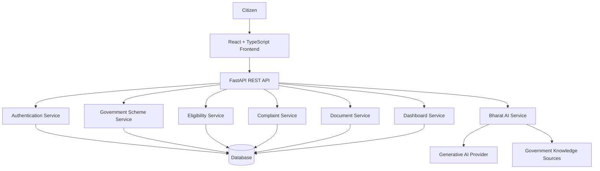

# smart_Bharat_AI-Powered-civic-companion
# 🇮🇳 Smart Bharat – AI-Powered Civic Companion

<p align="center">
  <strong>Government Services. Simplified by AI.</strong>
</p>

<p align="center">
  A modern AI-powered civic technology platform designed to help Indian citizens discover government schemes, understand eligibility requirements, access civic services, report public issues, track complaints, and receive intelligent multilingual assistance.
</p>

<p align="center">
  <a href="https://smart-bharat.netlify.app/">
    <strong>🚀 Live Demo</strong>
  </a>
  &nbsp;&nbsp;•&nbsp;&nbsp;
  <a href="https://smart-bharat-ai-powered-civic-companion.onrender.com/">
    <strong>⚙️ Backend API</strong>
  </a>
  &nbsp;&nbsp;•&nbsp;&nbsp;
  <a href="https://github.com/Neerajupadhayay2004/smart_Bharat_AI-Powered-civic-companion">
    <strong>💻 GitHub Repository</strong>
  </a>
</p>

---


# 🚀 Live Application

The Smart Bharat platform is deployed and available online.

### 🌐 Frontend Application

https://smart-bharat.netlify.app/

### ⚙️ Backend API

https://smart-bharat-ai-powered-civic-companion.onrender.com/

### 💻 GitHub Repository

https://github.com/Neerajupadhayay2004/smart_Bharat_AI-Powered-civic-companion

> **Note:** The backend is deployed on Render's free hosting tier. The first API request may take some time while the service wakes up after inactivity.

---

# 📌 Table of Contents

* [About Smart Bharat](#-about-smart-bharat)
* [Problem Statement](#-problem-statement)
* [Our Solution](#-our-solution)
* [Why Smart Bharat Is Different](#-why-smart-bharat-is-different)
* [Live Application](#-live-application)
* [Key Features](#-key-features)
* [Bharat AI Civic Companion](#-bharat-ai-civic-companion)
* [AI Workflow](#-ai-workflow)
* [System Architecture](#-system-architecture)
* [Technology Stack](#-technology-stack)
* [Project Structure](#-project-structure)
* [Installation and Setup](#-installation-and-setup)
* [Environment Variables](#-environment-variables)
* [Running the Application](#-running-the-application)
* [API Documentation](#-api-documentation)
* [Main API Endpoints](#-main-api-endpoints)
* [Deployment Architecture](#-deployment-architecture)
* [Security and Privacy](#-security-and-privacy)
* [Responsible AI](#-responsible-ai)
* [Accessibility](#-accessibility)
* [Hackathon Demo Flow](#-hackathon-demo-flow)
* [Future Roadmap](#-future-roadmap)
* [Project Impact](#-project-impact)
* [Contributing](#-contributing)
* [License](#-license)
* [Author](#-author)

---

# 🇮🇳 About Smart Bharat

**Smart Bharat – AI-Powered Civic Companion** is a civic technology platform designed to simplify how citizens interact with government schemes, public services, and civic authorities.

Citizens often struggle with fragmented government portals, complicated eligibility rules, language barriers, unclear documentation requirements, and difficult complaint processes.

Smart Bharat brings these interactions together into a single citizen-friendly digital platform.

Instead of navigating multiple portals and understanding complicated government terminology, citizens can interact with Smart Bharat through a modern and easy-to-use interface.

The platform aims to help citizens:

* Discover relevant government schemes.
* Understand eligibility requirements.
* Access information about government services.
* Receive intelligent civic assistance.
* Understand required documents.
* Report public infrastructure issues.
* Track civic complaints.
* Access multilingual assistance.
* Monitor civic activities through a unified dashboard.

---

# 🚨 Problem Statement

India provides thousands of government schemes, welfare programs, and public services.

However, many citizens face difficulties accessing them.

Common challenges include:

* Government information distributed across multiple websites.
* Complicated eligibility criteria.
* Lack of personalized scheme recommendations.
* Difficult government terminology.
* Language barriers.
* Low digital literacy.
* Confusion regarding required documents.
* Complicated civic complaint procedures.
* Lack of transparent complaint tracking.
* Limited awareness of available government benefits.

Citizens often spend significant time searching different portals to understand which government schemes or services may be relevant to them.

This creates an accessibility gap between government services and the citizens who need them.

---

# 💡 Our Solution

Smart Bharat provides a unified civic assistance platform.

A citizen can describe their needs using natural language.

### Example Query

> “I am an engineering student from Bihar and my family income is ₹2 lakh per year. Which government schemes can help me?”

Smart Bharat can help the citizen:

1. Understand the citizen's request.

2. Discover potentially relevant government schemes.

3. Explain eligibility requirements in simple language.

4. Identify documents that may be required.

5. Recommend useful next actions.

6. Access civic services.

7. Report public infrastructure problems.

8. Track submitted complaints.

9. Receive multilingual assistance.

10. View civic activities through a unified Civic Journey.

---

# 🏆 Why Smart Bharat Is Different

Smart Bharat is designed to go beyond traditional government information portals.

It is an:

> **AI-Powered Civic Action Platform**

Traditional portals mainly provide information.

Generic AI chatbots mainly provide answers.

Smart Bharat aims to provide a complete civic journey.

```text
ASK
 ↓
DISCOVER
 ↓
UNDERSTAND
 ↓
CHECK ELIGIBILITY
 ↓
PREPARE DOCUMENTS
 ↓
TAKE ACTION
 ↓
TRACK PROGRESS
 ↓
FOLLOW UP
```

The platform brings together:

* Generative AI.
* Government Scheme Discovery.
* Eligibility Assistance.
* Document Guidance.
* Civic Issue Reporting.
* Complaint Tracking.
* Multilingual Assistance.
* Civic Journey Tracking.
* Civic Analytics.
* AI Transparency.

---

# ✨ Key Features

## 🤖 Bharat AI Civic Companion

Smart Bharat includes an intelligent conversational civic assistant.

The Bharat AI Civic Companion is designed to help users interact with civic information using natural language.

Capabilities include:

* Natural language conversations.
* Citizen query assistance.
* Government scheme discovery.
* Civic service guidance.
* Eligibility explanations.
* Document requirement guidance.
* Complaint assistance.
* Context-aware interactions.
* Personalized civic recommendations.
* Simple-language explanations.
* Multilingual assistance.

---

## 🎯 Government Scheme Discovery

Citizens can explore government schemes and welfare programs.

Scheme information may include:

* Scheme name.
* Scheme category.
* Description.
* Target beneficiaries.
* Eligibility requirements.
* Required documents.
* Application process.
* Government department.
* State or national availability.
* Official information source.
* Recommended next action.

---

## 🧠 Eligibility Assistance

Smart Bharat helps citizens understand complicated eligibility requirements.

The system can provide:

* Eligibility conditions.
* Matched conditions.
* Missing information.
* Conditions requiring verification.
* Required documents.
* Recommended next actions.

> AI-generated eligibility assistance is preliminary guidance and does not replace official government eligibility verification.

---

## 📢 Civic Issue Reporter

Citizens can use Smart Bharat to report public infrastructure problems.

Supported issue categories may include:

* Garbage problems.
* Potholes.
* Broken streetlights.
* Water leakage.
* Drainage problems.
* Road damage.
* Illegal dumping.
* Public infrastructure issues.
* Other civic problems.

Users can submit issue descriptions and relevant information through the platform.

The system can help:

* Categorize the issue.
* Structure the complaint.
* Generate complaint descriptions.
* Create complaint records.
* Display complaint status.
* Track complaint progress.

---

## 📍 Complaint Tracking

Citizens can track reported civic problems through a transparent complaint workflow.

Complaint information can include:

* Complaint ID.
* Issue title.
* Issue category.
* Submission date.
* Current status.
* Responsible department.
* Complaint description.
* Status updates.
* Resolution progress.

---

## 📄 Document Assistance

Government schemes and services often require multiple documents.

Smart Bharat helps citizens understand these requirements.

Features may include:

* Scheme-specific document requirements.
* Document checklists.
* Missing document guidance.
* Document readiness assistance.
* Recommended next steps.

---

## 🌐 Multilingual Civic Assistance

Smart Bharat is designed to reduce language barriers.

The platform supports civic interactions through:

* English.
* Hindi.
* Hinglish.

The architecture can be extended to support additional Indian languages.

---

## 🧭 Civic Journey

The Civic Journey provides citizens with a unified view of their interactions with civic services.

Journey activities may include:

* Scheme discovered.
* Eligibility checked.
* Documents prepared.
* Application started.
* Complaint submitted.
* Complaint updated.
* Complaint escalated.
* Issue resolved.

This creates a connected citizen experience instead of isolated interactions.

---

## 🔍 AI Transparency

Smart Bharat promotes responsible use of Artificial Intelligence.

AI-powered civic assistance should provide:

* Information sources when available.
* Important uncertainties.
* Recommendation explanations.
* Verification guidance.
* Confidence indicators where supported.

Users should always verify important government information through official government portals.

---

## 📊 Citizen Dashboard

The citizen dashboard provides a centralized overview of civic activities.

Dashboard information may include:

* Recommended government schemes.
* Active complaints.
* Recent civic activities.
* Eligibility checks.
* Civic Journey timeline.
* Quick actions.
* Citizen impact statistics.

---

## 🏛️ Civic Analytics Dashboard

The platform can provide civic insights using anonymized complaint and interaction data.

Dashboard capabilities may include:

* Complaint analytics.
* Issue categories.
* Complaint status statistics.
* Resolution trends.
* Civic activity metrics.
* Public issue insights.

---

# ⚙️ AI Workflow

```text
Citizen Query
      │
      ▼
Language Understanding
      │
      ▼
Intent Identification
      │
      ▼
Citizen Context
      │
      ▼
Government Information Retrieval
      │
      ▼
Relevant Context Selection
      │
      ▼
AI Response Generation
      │
      ▼
Response Validation
      │
      ▼
Citizen-Friendly Explanation
      │
      ▼
Recommended Civic Actions
```

---

# 🏗️ System Architecture



---

# 🛠️ Technology Stack

## Frontend

* React.
* TypeScript.
* Vite.
* Tailwind CSS.
* Modern Responsive UI.
* Component-Based Architecture.
* Netlify Deployment.

## Backend

* Python.
* FastAPI.
* Uvicorn.
* REST APIs.
* Pydantic.
* Environment-based configuration.
* Render Deployment.

## Artificial Intelligence

The architecture is designed to support:

* Generative AI APIs.
* Gemini API.
* Large Language Models.
* Prompt-based AI assistance.
* Retrieval-Augmented Generation.
* Multilingual AI.
* Structured AI responses.

## Development and Deployment

* Git.
* GitHub.
* Node.js.
* npm.
* Python Virtual Environments.
* Netlify.
* Render.

---

# 📁 Project Structure

```text
smart_Bharat_AI-Powered-civic-companion/
│
├── public/
│
├── src/
│   ├── components/
│   ├── pages/
│   ├── hooks/
│   ├── lib/
│   ├── services/
│   ├── assets/
│   ├── App.tsx
│   └── main.tsx
│
├── backend/
│   ├── app/
│   ├── services/
│   ├── models/
│   ├── routes/
│   ├── main.py
│   ├── requirements.txt
│   └── .env.example
│
├── .gitignore
├── package.json
├── vite.config.ts
├── netlify.toml
└── README.md
```

> The exact project structure may evolve as new features and services are implemented.

---

# 🚀 Installation and Setup

## Prerequisites

Install:

* Git.
* Node.js 18 or newer.
* npm.
* Python 3.10 or newer.

Check installed versions:

```bash
git --version

node --version

npm --version

python --version
```

---

# 📥 Clone Repository

```bash
git clone https://github.com/Neerajupadhayay2004/smart_Bharat_AI-Powered-civic-companion.git

cd smart_Bharat_AI-Powered-civic-companion
```

---

# 🎨 Frontend Setup

Install frontend dependencies.

```bash
npm install
```

Create the frontend environment configuration if required.

```bash
cp .env.example .env
```

Start the frontend development server.

```bash
npm run dev
```

The frontend development server normally runs at:

```text
http://localhost:5173
```

---

# ⚙️ Backend Setup

Navigate to the backend directory.

```bash
cd backend
```

Create a Python virtual environment.

```bash
python -m venv venv
```

Activate the virtual environment.

### Linux / macOS

```bash
source venv/bin/activate
```

### Windows CMD

```bash
venv\Scripts\activate
```

### Windows PowerShell

```powershell
venv\Scripts\Activate.ps1
```

Install backend dependencies.

```bash
pip install -r requirements.txt
```

Create environment configuration.

```bash
cp .env.example .env
```

Start the FastAPI development server.

```bash
uvicorn main:app --reload
```

If the FastAPI application is located inside `backend/app/main.py`, use:

```bash
uvicorn app.main:app --reload
```

The backend normally runs at:

```text
http://127.0.0.1:8000
```

---

# 🔐 Environment Variables

Create a `.env` file inside the backend directory.

Example:

```env
APP_NAME=Smart Bharat
APP_ENV=development
DEBUG=true

HOST=0.0.0.0
PORT=8000

GEMINI_API_KEY=YOUR_GEMINI_API_KEY

CORS_ORIGINS=http://localhost:5173
```

Frontend environment configuration example:

```env
VITE_API_URL=http://localhost:8000
```

> Never commit `.env` files, API keys, passwords, access tokens, or other secrets to GitHub.

---

# ▶️ Running the Application

Use two terminal windows.

## Terminal 1 — Backend

```bash
cd backend

source venv/bin/activate

uvicorn main:app --host 0.0.0.0 --port 8000 --reload
```

If the backend entry point is `app/main.py`:

```bash
uvicorn app.main:app --host 0.0.0.0 --port 8000 --reload
```

## Terminal 2 — Frontend

```bash
npm install

npm run dev
```

Open:

```text
http://localhost:5173
```

---

# 📚 API Documentation

FastAPI automatically generates interactive API documentation.

When running locally:

### Swagger UI

```text
http://localhost:8000/docs
```

### ReDoc

```text
http://localhost:8000/redoc
```

Production backend:

```text
https://smart-bharat-ai-powered-civic-companion.onrender.com/
```

---

# 🔌 Main API Endpoints

The exact API endpoints depend on the current backend implementation.

A recommended API structure is:

## System

```text
GET /
GET /health
GET /api/health
```

## AI Assistant

```text
POST /api/ai/chat
POST /api/ai/explain
POST /api/ai/translate
```

## Government Schemes

```text
GET  /api/schemes
GET  /api/schemes/search
GET  /api/schemes/{id}
POST /api/schemes/{id}/eligibility
```

## Complaints

```text
POST  /api/complaints
GET   /api/complaints
GET   /api/complaints/{id}
PATCH /api/complaints/{id}
```

## Documents

```text
GET  /api/documents/checklist
POST /api/documents/analyze
```

## Dashboard

```text
GET /api/dashboard
GET /api/dashboard/citizen
GET /api/dashboard/analytics
```

> Some endpoints listed above may represent planned functionality depending on the current development status of the project.

---

# 🌍 Deployment Architecture

```text
                    USER
                      │
                      ▼
         ┌────────────────────────┐
         │       NETLIFY          │
         │ React + TypeScript UI  │
         └────────────┬───────────┘
                      │
                      │ HTTPS REST API
                      ▼
         ┌────────────────────────┐
         │        RENDER          │
         │    FastAPI Backend     │
         └────────────┬───────────┘
                      │
             ┌────────┴────────┐
             │                 │
             ▼                 ▼
      Generative AI        Application
         Provider             Data
```

### Production Services

Frontend:

```text
https://smart-bharat.netlify.app/
```

Backend:

```text
https://smart-bharat-ai-powered-civic-companion.onrender.com/
```

Source Code:

```text
https://github.com/Neerajupadhayay2004/smart_Bharat_AI-Powered-civic-companion
```

---

# 🔒 Security and Privacy

Smart Bharat should follow privacy-first engineering practices.

Security measures include or are planned to include:

* Environment-based secrets.
* Secure API configuration.
* CORS restrictions.
* Request validation.
* File upload restrictions.
* Input sanitization.
* Error handling.
* API rate limiting.
* Secure authentication.
* Role-based authorization.
* Audit logging.
* Protection of sensitive citizen information.

Important security principles:

* Never expose API keys in frontend code.
* Never commit secrets to GitHub.
* Validate all backend input.
* Restrict uploaded file types and sizes.
* Avoid unnecessary collection of sensitive citizen information.
* Use HTTPS in production.
* Store passwords only using secure password hashing algorithms.

---

# 🛡️ Responsible AI

Smart Bharat aims to use Artificial Intelligence responsibly.

## Government Information Verification

Important government information should be verified using official sources.

## AI Limitations

AI-generated answers may contain incomplete or outdated information.

Users should verify critical information through official government portals.

## Eligibility Disclaimer

AI eligibility guidance is preliminary assistance.

Final eligibility decisions are made by the relevant government authority.

## Source Transparency

Where available, Smart Bharat should display information sources and verification guidance.

## Privacy

Users should only be asked for personal information that is necessary for providing the requested service.

## Human Control

Citizens remain in control of final decisions, applications, complaints, and document submissions.

---

# ♿ Accessibility

Smart Bharat aims to make civic services easier to access for citizens with different levels of digital literacy.

Accessibility goals include:

* Mobile-responsive interface.
* Keyboard navigation.
* Semantic HTML.
* Screen-reader compatibility.
* High-contrast interface support.
* Large touch targets.
* Simple-language explanations.
* Multilingual interaction.
* Voice interaction support.
* Low-bandwidth-friendly experiences.

---

# 🎬 Hackathon Demo Flow

A recommended Smart Bharat demonstration:

## Step 1 — Open Smart Bharat

Visit the live application.

```text
https://smart-bharat.netlify.app/
```

## Step 2 — Explore Citizen Dashboard

Show:

* Government schemes.
* Civic services.
* Citizen dashboard.
* Quick actions.

## Step 3 — Ask Bharat AI

Example:

> “I am an engineering student from Bihar and my family income is ₹2 lakh per year. Which government schemes can help me?”

Demonstrate how the AI Civic Companion helps simplify government information.

## Step 4 — Explore Government Schemes

Show:

* Scheme information.
* Eligibility requirements.
* Required documents.
* Application guidance.

## Step 5 — Demonstrate Eligibility Assistance

Explain how Smart Bharat simplifies eligibility requirements and recommends next actions.

## Step 6 — Report a Civic Issue

Demonstrate:

* Issue reporting.
* Complaint description.
* Complaint submission.

## Step 7 — Track Complaint

Show the citizen complaint tracking workflow.

## Step 8 — Show Civic Dashboard

Demonstrate how Smart Bharat brings different civic services into one unified citizen experience.

## Step 9 — Finish With Impact

Explain the core vision:

> **One intelligent platform where citizens can discover, understand, access, and track civic services.**

---

# 🔮 Future Roadmap

Future improvements include:

* Retrieval-Augmented Generation using verified government information.
* Vector database integration.
* Advanced government scheme recommendation engine.
* Additional Indian languages.
* Voice-based AI assistance.
* Text-to-speech.
* Advanced document analysis.
* OCR integration.
* Civic issue image classification.
* Interactive issue maps.
* Geolocation-based complaint discovery.
* Real-time complaint notifications.
* Advanced complaint escalation workflows.
* Progressive Web App support.
* Offline-first civic services.
* DigiLocker integration where officially supported.
* UMANG integration where officially supported.
* Verified government API integrations.
* WhatsApp Civic Assistant.
* IVR-based civic assistance.
* District-level civic intelligence dashboards.
* AI Civic Pulse.
* Privacy-preserving civic analytics.

---

# 🌍 Project Impact

Smart Bharat aims to contribute toward:

### Digital Inclusion

Making civic information easier to understand for citizens with different levels of digital literacy.

### Government Scheme Awareness

Helping citizens discover government schemes and public services.

### Accessibility

Reducing language and technology barriers.

### Transparency

Providing clearer civic workflows and complaint tracking.

### Citizen Empowerment

Helping citizens understand civic services and make informed decisions.

### Responsible Artificial Intelligence

Encouraging transparent and responsible use of AI for citizen-facing applications.

---

# 🤝 Contributing

Contributions are welcome.

Fork the repository.

Create a feature branch.

```bash
git checkout -b feature/your-feature-name
```

Add your changes.

```bash
git add .
```

Commit your changes.

```bash
git commit -m "Add new feature"
```

Push the branch.

```bash
git push origin feature/your-feature-name
```

Open a Pull Request on GitHub.

---

# 📜 License

This project is developed for educational, research, civic technology, and hackathon purposes.

Before production distribution, add an appropriate open-source license.

Recommended license:

**MIT License**

---

# 👨‍💻 Author

## Neeraj Upadhayay

**B.Tech Computer Science Engineering | Cybersecurity Student**

Areas of Interest:

* Artificial Intelligence.
* Generative AI.
* Cybersecurity.
* Full-Stack Development.
* Civic Technology.
* AI-Powered Applications.

### GitHub

https://github.com/Neerajupadhayay2004

### Project Repository

https://github.com/Neerajupadhayay2004/smart_Bharat_AI-Powered-civic-companion

---

# ⭐ Support the Project

If you find Smart Bharat useful or interesting, consider giving the repository a ⭐.

Your support encourages continued development of AI-powered civic technology solutions.

---

<p align="center">
  <strong>🇮🇳 Smart Bharat – AI-Powered Civic Companion</strong>
</p>

<p align="center">
  Government Services. Simplified by AI.
</p>

<p align="center">
  Discover • Understand • Access • Report • Track
</p>

<p align="center">
  Built with ❤️ for a Smarter, Accessible, Transparent, and Inclusive Bharat.
</p>
